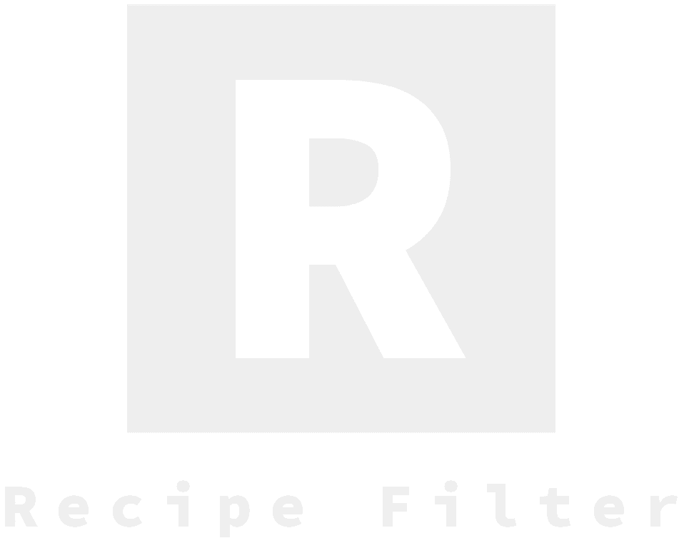

<!-- Logo -->

  

<!-- Name -->
<h1 align="center">Recipe Filter - Example</h1>

<!-- Badges -->

    Listing example and recipe filter in <a href="http://facebook.github.io/react/">React</a>

<!-- Imagens de build -->

----------------------
## Requirements
- :heavy_check_mark: **Node** >= 8
- :heavy_check_mark: **Yarn** (or NPM)

----------------------
## Installation

Clone this repo, install the dependencies and start the app.

> git clone https://github.com/DittrichLucas/recipes-filter.git

> yarn

> yarn start
----------------------
## Screenshots

----------------------

***
## Contributing

1. Make the project fork (<https://github.com/DittrichLucas/recipes-filter>)
1. Create a _branch_ for your modification (`git checkout -b feature/fooBar`)
1. Do the _commit_ (`git commit -am 'Add some fooBar'`)
1. _Push_ (`git push origin feature/fooBar`)
1. Create a new _Pull Request_

## License

[MIT](https://github.com/DittrichLucas/recipes-filter/blob/master/LICENSE)
